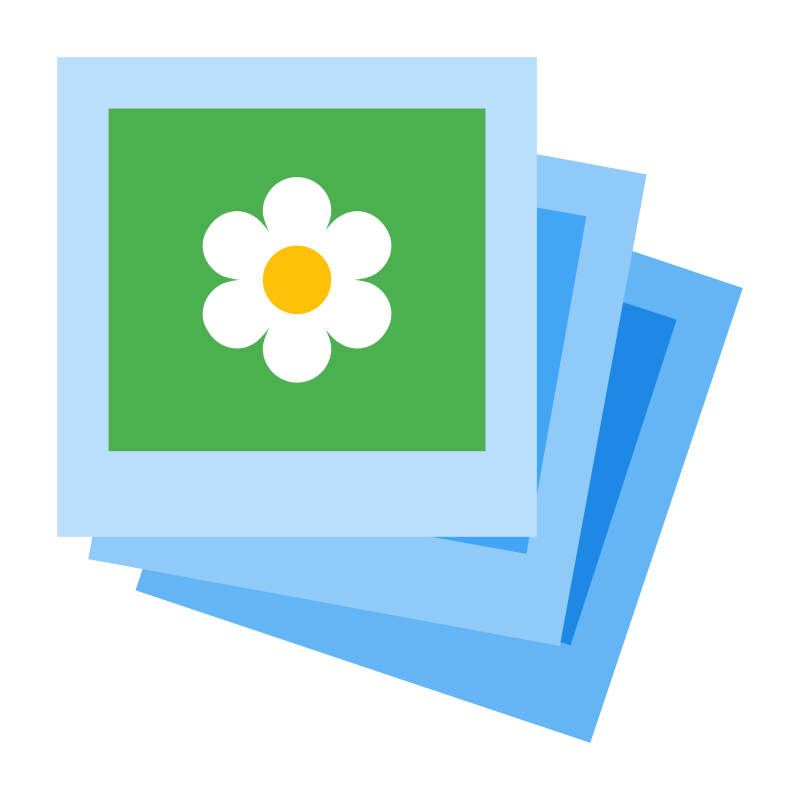

<a id="readme-top"></a>

<!-- PROJECT SHIELDS -->
[![Contributors][contributors-shield]][contributors-url]
[![Forks][forks-shield]][forks-url]
[![Stargazers][stars-shield]][stars-url]
[![Issues][issues-shield]][issues-url]
[![Unlicense License][license-shield]][license-url]

<!-- PROJECT LOGO -->
<br />
<div align="center">
  <a href="https://github.com/duyk471/ipr_final">
    
  </a>

  <h3 align="center">Canvee - Synthetic Stylist AI</h3>

  <p align="center">
    A professional, local-first image editor with biophilic design and AI-powered creativity.
    <br />
    <br />
    <a href="#usage"><strong>Explore the features »</strong></a>
    <br />
    <br />
    <a href="#getting-started">Get Started</a>
    &middot;
    <a href="#roadmap">Roadmap</a>
    &middot;
    <a href="#contact">Contact</a>
  </p>
</div>

<!-- TABLE OF CONTENTS -->
<details>
  <summary>Table of Contents</summary>
  <ol>
    <li>
      <a href="#about-the-project">About The Project</a>
      <ul>
        <li><a href="#built-with">Built With</a></li>
      </ul>
    </li>
    <li>
      <a href="#getting-started">Getting Started</a>
      <ul>
        <li><a href="#prerequisites">Prerequisites</a></li>
        <li><a href="#installation">Installation</a></li>
      </ul>
    </li>
    <li><a href="#usage">Usage</a></li>
    <li><a href="#roadmap">Roadmap</a></li>
    <li><a href="#contributing">Contributing</a></li>
    <li><a href="#license">License</a></li>
    <li><a href="#contact">Contact</a></li>
    <li><a href="#acknowledgments">Acknowledgments</a></li>
  </ol>
</details>

<!-- ABOUT THE PROJECT -->
## About The Project

[![Canvee Screen Shot][product-screenshot]]()

Canvee is a local-first, biophilic image editor designed for professional creators who need privacy, speed, and AI-assisted design workflows. The application stores project state in a single `index.json` file while delivering advanced canvas controls, multi-model AI features, and a serene Sage Green / Creamy interface.

Canvee combines a Fabric.js-based canvas engine with a Node backend for AI services such as Gemini, FLUX, BLIP, and local background removal.

<p align="right">(<a href="#readme-top">back to top</a>)</p>

### Built With

* [![React][React.js]][React-url]
* [![Vite][Vite]][Vite-url]
* [![Tailwind CSS][TailwindCSS]][TailwindCSS-url]
* [![Express][Express.js]][Express-url]
* [![Fabric.js][Fabric.js]][Fabric-url]
* [![Node.js][Node.js]][Node-url]

<p align="right">(<a href="#readme-top">back to top</a>)</p>

### Preview (Youtube)

[](https://www.youtube.com/embed/AvdfS3MtjCE)

<!-- GETTING STARTED -->
## Getting Started

### Prerequisites

* Node.js 18+ and npm
* A modern browser with File System Access API support
* Optional AI provider API keys for Gemini, Hugging Face, and Pollinations services

### Installation

1. Clone the repo

   ```sh
   git clone https://github.com/duyk471/ipr_final.git
   cd ipr_final
   ```

2. Install backend dependencies

   ```sh
   cd backend
   npm install
   ```

3. Install frontend dependencies

   ```sh
   cd ../frontend
   npm install
   ```

4. **Download local fonts** (Required for the editor)

   ```sh
   npm run download-fonts
   ```

5. Configure AI environment variables

   ```sh
   cp ../backend/.env.example ../backend/.env
   ```

   Update the `.env` file with your provider keys and any local AI configuration.
6. Start the backend service

   ```sh
   cd ../backend
   npm run dev
   ```

7. Start the frontend app

   ```sh
   cd ../frontend
   npm run dev
   ```

8. Open the app in the browser at the URL shown by Vite.

<p align="right">(<a href="#readme-top">back to top</a>)</p>

<!-- USAGE EXAMPLES -->
## Usage

Canvee is designed to support a privacy-first image editing workflow with AI-powered creative tools.

* Open or create a project and store the complete state in `index.json`
* Use Fabric.js canvas controls for smooth panning, zooming, and layer management
* Adjust layer filters including brightness, contrast, hue, and blur
* Use snapping and alignment guides for precise layout work
* Invoke AI features for layout improvement, prompt expansion, and image generation
* Remove backgrounds locally with `@imgly/background-removal-node` and clean alpha transparency with Sharp
* Generate compositions using FLUX image-to-image and curate palettes with Gemini Flash Lite

_For more examples, please refer to the project documentation or issue tracker._

<p align="right">(<a href="#readme-top">back to top</a>)</p>

<!-- ROADMAP -->
## Roadmap

* [x] Local-first editor and `index.json` project state
* [x] Fabric.js canvas engine with panning, zooming, and undo/redo
* [x] AI Design Assistant and prompt expansion
* [x] Full Gemini/FLUX model integration in production
* [x] Enhanced theme engine and palette mapping
* [ ] Desktop wrapper and offline-first packaging

See the [open issues](https://github.com/duyk471/ipr_final/issues) for a full list of proposed features and known issues.

<p align="right">(<a href="#readme-top">back to top</a>)</p>

<!-- CONTRIBUTING -->
## Contributing

Contributions are what make the open source community such an amazing place to learn, inspire, and create. Any contributions you make are **greatly appreciated**.

If you have a suggestion that would make this better, please fork the repo and create a pull request. You can also simply open an issue.

1. Fork the Project
2. Create your Feature Branch (`git checkout -b feature/AmazingFeature`)
3. Commit your Changes (`git commit -m 'Add some AmazingFeature'`)
4. Push to the Branch (`git push origin feature/AmazingFeature`)
5. Open a Pull Request

### Top contributors

<a href="https://github.com/duyk471/ipr_final/graphs/contributors">
  
</a>

<p align="right">(<a href="#readme-top">back to top</a>)</p>

<!-- LICENSE -->
## License

Distributed under the Unlicense License. See `LICENSE.txt` for more information.

<p align="right">(<a href="#readme-top">back to top</a>)</p>

<!-- CONTACT -->
## Contact

Project Link: [https://github.com/duyk471/ipr_final](https://github.com/duyk471/ipr_final)

<p align="right">(<a href="#readme-top">back to top</a>)</p>

<!-- MARKDOWN LINKS & IMAGES -->
<!-- https://www.markdownguide.org/basic-syntax/#reference-style-links -->
[contributors-shield]: https://img.shields.io/github/contributors/duyk471/ipr_final.svg?style=for-the-badge
[contributors-url]: https://github.com/duyk471/ipr_final/graphs/contributors
[forks-shield]: https://img.shields.io/github/forks/duyk471/ipr_final.svg?style=for-the-badge
[forks-url]: https://github.com/duyk471/ipr_final/network/members
[stars-shield]: https://img.shields.io/github/stars/duyk471/ipr_final.svg?style=for-the-badge
[stars-url]: https://github.com/duyk471/ipr_final/stargazers
[issues-shield]: https://img.shields.io/github/issues/duyk471/ipr_final.svg?style=for-the-badge
[issues-url]: https://github.com/duyk471/ipr_final/issues
[license-shield]: https://img.shields.io/github/license/duyk471/ipr_final.svg?style=for-the-badge
[license-url]: https://github.com/duyk471/ipr_final/blob/master/LICENSE.txt
[product-screenshot]: images/screenshot.png
[React.js]: https://img.shields.io/badge/React-20232A?style=for-the-badge&logo=react&logoColor=61DAFB
[React-url]: https://reactjs.org/
[Vite]: https://img.shields.io/badge/Vite-646CFF?style=for-the-badge&logo=vite&logoColor=white
[Vite-url]: https://vitejs.dev/
[TailwindCSS]: https://img.shields.io/badge/Tailwind_CSS-06B6D4?style=for-the-badge&logo=tailwind-css&logoColor=white
[TailwindCSS-url]: https://tailwindcss.com/
[Express.js]: https://img.shields.io/badge/Express-000000?style=for-the-badge&logo=express&logoColor=white
[Express-url]: https://expressjs.com/
[Fabric.js]: https://img.shields.io/badge/Fabric.js-3A4F99?style=for-the-badge&logo=fabric.js&logoColor=white
[Fabric-url]: https://fabricjs.com/
[Node.js]: https://img.shields.io/badge/Node.js-339933?style=for-the-badge&logo=node.js&logoColor=white
[Node-url]: https://nodejs.org/
