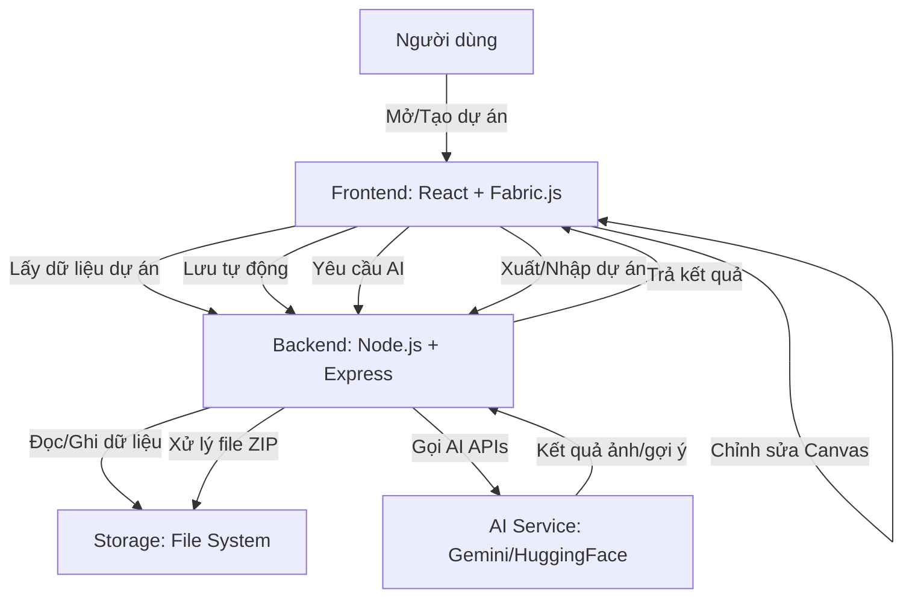

```mermaid
flowchart TD
    U[Người dùng]
    FE[Frontend: React + Fabric.js]
    BE[Backend: Node.js + Express]
    ST[Storage: File System]
    AI[AI Service: Gemini/HuggingFace]

    U -->|Mở/Tạo dự án| FE
    FE -->|Lấy dữ liệu dự án| BE
    BE -->|Đọc/Ghi dữ liệu| ST
    FE -->|Chỉnh sửa Canvas| FE
    FE -->|Lưu tự động| BE
    FE -->|Yêu cầu AI| BE
    BE -->|Gọi AI APIs| AI
    AI -->|Kết quả ảnh/gợi ý| BE
    BE -->|Trả kết quả| FE
    FE -->|Xuất/Nhập dự án| BE
    BE -->|Xử lý file ZIP| ST
```
